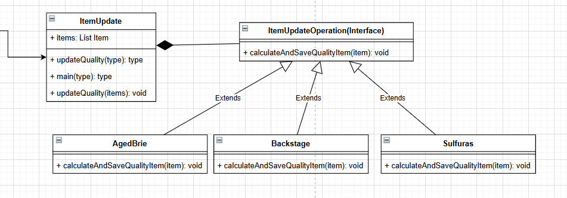

# EXPLICACIÓN DE LA RESOLUCIÓN DE LA PROBLEMATICA GILDROSE

## **Primer paso: clase estatica para los nombres**

He creado la [Utils/NameItem.java](https://github.com/usuario/repositorio/blob/main/src/MostrarImagen.java) para guardar las constantes que son los nombres de items para que el codigo no sea tan vulnerable a errores ,quiza otra persona se equivoque y al hacer referencia un nombre,etc. :

```java
public class NameItem {
    public static final String BACKSTAGE = "Backstage passes to a TAFKAL80ETC concert";
    public static final String AGED_BRIE = "Aged Brie";
    public static final String SULFURAS = "Sulfuras, Hand of Ragnaros";
    public static final String CONJURED = "Conjured Mana Cake";
    public static final String DEXTERITY = "+5 Dexterity Vest";
    public static final String ELIXIR = "Elixir of the Mongoose";
}

```

## **Segundo paso: Carpeta y clases para guardar la logica**

He creado la clase [Logic/ItemUpdate.java](https://github.com/usuario/repositorio/blob/main/src/MostrarImagen.java) para guardar la logica de inicializacion de los items y tambien el updateQuality despues he visto la necesidad entre usar dos patrones de diseño para separar el calculo de la calidad entonces lo que hice fue hacer un digrama de clases decidiendo usar el patron estrategia para separar el calculo de la calidad por item :



entonces el for lo cambio por foreach y navego por todos los elemento creo la interface Logic/ItemUpdateOperation.java con el metodo calculateAndSaveQualityItem para luego crear cada clase por separado esa seria la refactorizacion que hice permitiendome solamente agregar funcionalidad sin leer la implementacion anterior:

```java
    public void updateQuality(List<Item> items) {
        this.items = items;
        for (Item item : items) {
          item.setSellIn(item.getSellIn() - 1);
          if (NameItem.AGED_BRIE.equals(item.getName())) {
              itemUpdateOperation = new AgedBrie();
          } else if (NameItem.BACKSTAGE.equals(item.getName())) {
              itemUpdateOperation = new Backstage();
          } else if (NameItem.SULFURAS.equals(item.getName())) {
              itemUpdateOperation = new Sulfuras();
          } else if (NameItem.CONJURED.equals(item.getName())) {
              itemUpdateOperation = new Conjured();
          } else {
              itemUpdateOperation = new Normal();
          }
          itemUpdateOperation.calculateAndSaveQualityItem(item);
        }
    }

```

## **Tercer paso: agregando nueva funcionalidad para Conjured**

Por ultimo, he creado la clase [Logic/Conjured.java](https://github.com/usuario/repositorio/blob/main/src/MostrarImagen.java) para crear el calculo del quality : verifico que no sea 0 ,luego si no es 1 entonces se restaria -2 o -4 dependiendo del sellin , ahora si es 1 simplemente el quelity seria 0

```java
    if(! (item.getQuality() <= 0)){
        if(! (item.getQuality() == 1)){
            if (item.getQuality() < 50) {
                item.setQuality(item.getQuality() - 2);
            }
            if (item.getSellIn() < 0) {
                item.setQuality(item.getQuality() - 2);
                if (item.getQuality() < 0) {
                    item.setQuality(0);
                }
            }
        }else{
            item.setQuality(0);
        }
    }
```

y luego lo use en ItemUpdate.java luego llamarlo desde el metodo estatico updateQuality de la clase GildedRose.java

## Cuarto paso: modificando la clase GildedRose.java

Por ultimo he modificado la clase principal y he agregado los metodos nuevos de ItemUpdate.java la carga inicial esta en su constructor y el metodo updateQuality tiene el mismo nombre todo denstro de los metodos estaticos para evitar errores y el metodo updateQuality hago de todas maneras si se fuese utilizar para las pruebas.
